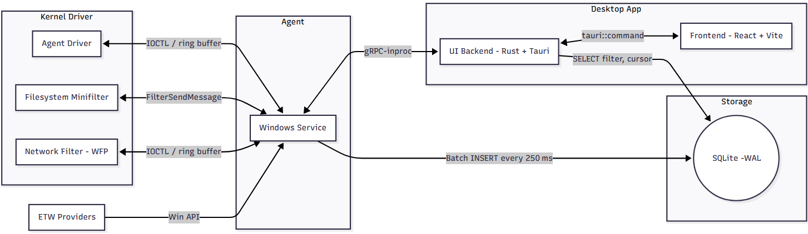

# Gladix

**Gladix** is a lightweight, modular EDR (Endpoint Detection and Response) system built in Rust for Windows environments. It is designed for learning, experimentation, and research, featuring a user-mode agent and a kernel-mode driver that work together to monitor file, process, and network activity.

> ⚠️ **Disclaimer:**
> This project is currently under active development. Some features described in this README — including detection logic, UI actions, and kernel telemetry handling — may not yet be fully implemented or stable. Expect frequent changes and incomplete functionality.


## 🧩 Architecture Overview

Gladix consists of three main components:
Here's a similar write-up style for your EDR desktop application, assuming it functions as a user-facing UI that interacts with the service and driver components:

### 🖥 [`desktop-ui`](./desktop-ui/)

A user-facing Windows desktop application for real-time EDR insights, alert triage, and response actions.
It interfaces with `user-agent` over gRPC and reflects telemetry and detection events.

- Subscribes to gRPC streams for alerts and telemetry
- Visualizes process trees, file events, and network flows
- Maintains local state cache in SQLite for offline inspection
- Supports analyst actions (quarantine, kill process, isolate host)
  
### 🤖 [`user-agent`](./user-agent/)

A Windows service responsible for static file analysis, telemetry processing, and detection logic.  
It communicates with both the kernel and a local GUI.

- Scans directories using YARA + heuristics
- Receives kernel telemetry via FilterSendMessage, IOCTL or Shared Section  
- Writes to SQLite (WAL) in batches  
- Provides a gRPC interface to the UI  


### 🧠 [`kernel-driver`](./kernel-driver/)

A Rust-based Windows kernel-mode driver that hooks into key system events.

- Filesystem monitoring via minifilter  
- Network flow inspection via WFP callouts  
- Process and Object notifications via callbacks  
- Sends data to user-agent, receives policies  


## 🗺 Architecture Diagram

Below is a visual representation of how the system components interact:




## 📁 Project Structure

```text
Gladix/
├── desktop-app/       # Tauri desktop application (visualization + configuration)
├── kernel-driver/     # Kernel-mode driver (minifilter, WFP, callbacks)
├── user-agent/        # User-mode agent service (file scanning, rule engine)
├── Cargo.toml         # Workspace definition
└── .cargo/config.toml # Optional linker/target overrides
```


## 🛠 Build Instructions

### Prerequisites

* 🦀 Rust (latest **stable** and **nightly** toolchains)
* 🪟 Windows (x86\_64 with **test-signing** enabled)
* [Protobuf](https://github.com/protocolbuffers/protobuf) (for gRPC/IDL generation)
* [windows-drivers-rs](https://github.com/microsoft/windows-drivers-rs) (Rust bindings for WDK)


### 🧱 Build & Install the Kernel Driver

First, compile and sign the driver (you'll need `cargo-make`):

```bash
cd kernel-driver
cargo make
```

Then install the driver:

> ⚠️ Requires `bcdedit /set testsigning on` and a system reboot before proceeding.

```cmd
sc create gladix_driver type= kernel binPath= "C:\path\to\kernel-driver.sys"
sc start gladix_driver
```

### ⚙️ Build & Run the User Agent

To compile and run the user-space service:

```bash
cd user-agent
cargo run --release
```

To install it as a Windows service:

```cmd
sc create gladix_agent binPath= "C:\path\to\user-agent.exe"
sc start gladix_agent
```


## 🧪 Project Goals

Gladix is meant to help you learn about:

- How kernel ↔ user communication works on Windows  
- Writing and testing minifilters and WFP callouts  
- Structuring an EDR pipeline from scratch  
- Static analysis of binaries with YARA  
- Avoiding common performance and stability pitfalls in security software  

