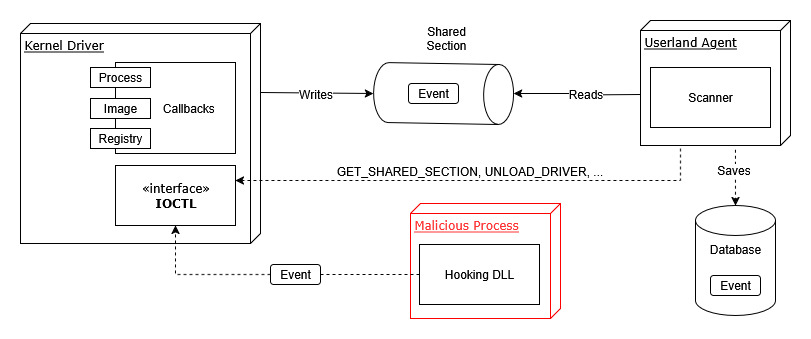

# Gladix – Basic EDR for Windows

> ⚠️ **Work in Progress**  
> This project is under active development. Features and interfaces may change at any time.

Gladix is a custom-built **Endpoint Detection and Response (EDR)** system for Windows, designed as a research and learning project.  
The goal is to understand and implement, from scratch, the core building blocks of an EDR:

- **Kernel sensors** to capture low-level telemetry (process, file, registry, network).
- **Userland agent** to process events, apply detection rules, and trigger responses.
- **DLL hooking library** to intercept critical Windows API calls.
- **Local storage** of events (SQLite, WAL mode) for efficient querying.

This project does **not** aim to be a production-ready EDR, but rather a practical foundation for experimentation, security research, and studying how endpoint sensors operate.


## 🖼️ Architecture




## 📂 Project Structure

The repository is organized as a Rust workspace:

- **`shared/`** – common definitions, Protocol Buffers schemas, event serialization.
- **`user-agent/`** – Windows service in userland, ingests telemetry, applies YARA rules, stores events.
- **`hooking-lib/`** – DLL for userland API hooking (e.g., `ntdll.dll` detours).
- **`kernel-driver/`** – Windows kernel driver (Rust + C bindings) for capturing process, file, registry, and network activity.


## 🛠️ Development

### Requirements
- Windows 10/11 (x64) with SDK 10.0.26100+
- [Rust](https://www.rust-lang.org/) (latest stable toolchain)
- [Visual Studio](https://visualstudio.microsoft.com/) (for Windows build tools)
- [WinDbg](https://learn.microsoft.com/en-us/windows-hardware/drivers/debugger/) (recommended for driver debugging)
- [SQLite](https://www.sqlite.org/) (bundled, no extra service required)
- Virtualization software (VMware/VirtualBox) for safe testing
- [Google Protocol Buffers (protoc)](https://grpc.io/docs/protoc-installation/) – required for compiling `.proto` schemas and serializing events
- [windows-drivers-rs](https://github.com/microsoft/windows-drivers-rs) – must be linked to the project before compiling the kernel driver


### Build
Clone the repository and build with Cargo:

```bash
git clone https://github.com/N10h0ggr/Gladix.git
```

To build the user agent, shared library, and the hooking DLL:
> **Setting Rules**:
> You may need to specify the path to your YARA rules in `user-agent/src/config/config.toml` before compiling.

```bash
cd gladix-refactor
cargo build --release
```

Since the kernel driver is compiled in `no_std`, it must be compiled separately:

> **Linking Windows Drivers libraries**:
> When building the `kernel-driver`, ensure that the **`windows-drivers-rs`** crate is properly linked in your `Cargo.toml`.

```bash
cd kernel-driver
cargo make
```

## ▶️ Run

1. **Install the kernel driver** (elevated prompt; adjust names/paths):

   With an **INF file**:

   ```cmd
   pnputil /add-driver path\to\driver.inf /install
   ```

   Without INF (legacy service install):

   ```cmd
   sc create Gladix type= kernel binPath= C:\path\to\gladix.sys start= demand
   sc start Gladix
   ```
2. **Run the userland agent** service:

   ```powershell
   .\target\release\user-agent.exe
   ```
3. **Inject the hooking DLL** into test processes (manual or automated).

⚠️ Only run in **isolated virtual machines**. The driver and DLL injection may cause instability.

## ✨ Features (current / roadmap)

* [x] Kernel callbacks for process, registry, and file events
* [x] Shared memory ring buffer for kernel ↔ userland communication
* [x] Event persistence in SQLite (WAL mode)
* [x] YARA-based file scanning
* [x] API hooking via DLL injection
* [x] Process image load monitoring
* [x] Registry key/value tracking
* [ ] Network activity visibility (via Windows Filtering Platform) – 🚧 roadmap
* [ ] Basic response actions (kill process, block operation) – 🚧 roadmap

